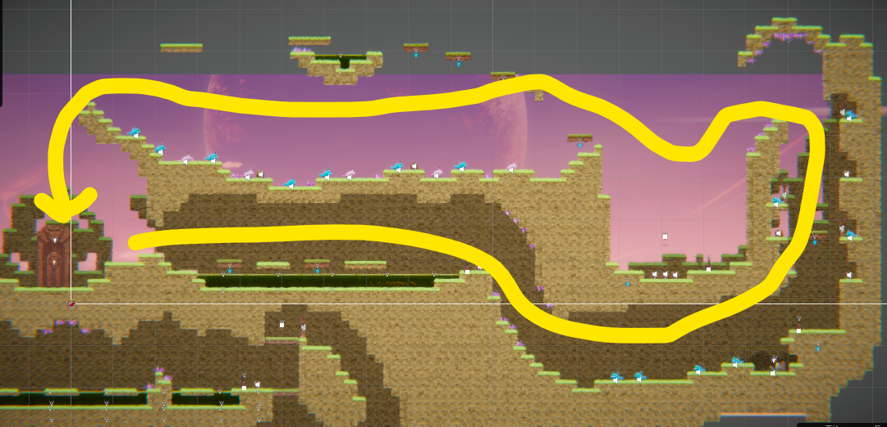
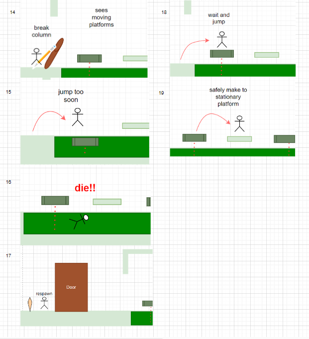
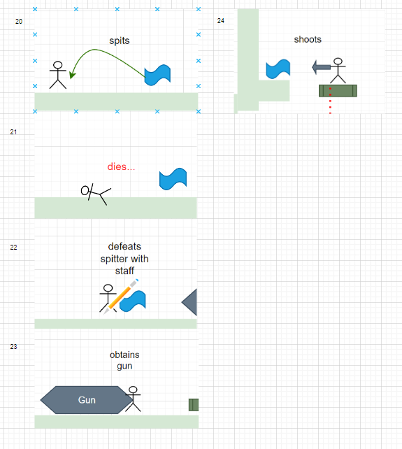
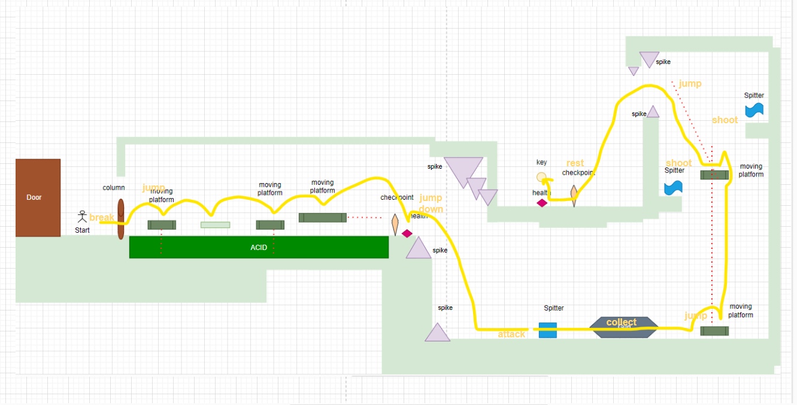

[](https://classroom.github.com/a/YyUO0xtt)
# COMP2150  - Level Design Document
### Name: [Michael Sadli]
### Student number: [47862637] 

This document discusses and reflects on the design of your platformer level for the Level Design assessment. It should be 1500 words. Make sure you delete this and all other instructional text throughout the document before checking your word count prior to submission. Hint: You can check word count by copying this text into a Word or Google doc.

Your document must include images. To insert an image into your documentation, place it in the "DocImages" folder in this repo, then place the below text where you want the image to appear:

```

```

Example:


## 1. Player Experience (~700 words)
Outline and justify how your level design facilitates the core player experience goals outlined in the assignment spec. Each section should be supported by specific examples and screenshots of your game encounters that highlight design choices made to facilitate that particular experience.

## 1.1. Discovery
What does the player learn? How does your encounter and broader level design facilitate learning in a way that follows good design practice

I have constructed my level such that the player is always building upon their knowledge, creating a positive feedback loop as they discover and tinker around with mechanics, recognise the resulting dynamics, and reinforce their overall knowledge of the way in which the world works. This is illustrated especially by my design of section 1, as mechanics of columns and enemies are introduced to the player at this initial stage:

At the very start, the player is teased by an impassable column, with some chompers behind it. However, as the player progresses they'll come to obtain the staff, and thus discover its destructive dynamic, as the mechanics of the fragility of the columns and the ability to kill enemies are revealed. Furthermore, this implicitly references the player’s next point of progression after obtaining the key, as the player makes the epiphany that they can go back to the column at the start, break it, and continue onwards. As such, my level design facilitates a positive loop of learning as the player is able to formulate their understanding of game mechanics through initial Discoveries, and develop them even further.

Image illustrates the connection of column and chomper mechanics in section 1

## 1.2. Drama
What is the intensity curve? How does your design facilitate increasing yet modulating intensity, with moments of tension and relief?

The intensity curve is rather intense as players are immediately plunged into a state of danger, hanging over an acid pool. However, this is modulated by respite in the form of health and checkpoints that, while sparse and few in between, grant the player a valuable reprieve to de-escalate the sense of Drama and tension. 

This is demonstrated in section 2, as after the player successfully makes it to the other side and is rewarded by the checkpoint, they are faced with the imminent threat of the first spike drop. As such, Drama and trepidation is facilitated as the player must make the decision to fall through the deadly drop, only to be met by an entourage of new, blue spitter enemies, instating a new sense of surprise and fear. This is epitomised by the ending of section 2, as the player weathers through a barrage of spitters and reaches a Dramatic forte once they reach the second spike drop, marking the end of the dramatic arc as it rapidly plummets to rest once the player falls through to arrive at the rest stop.

 Image illustrates trepidation of initial spike drop of section 2

 Image illustrates adrenaline of second spike drop after avoiding spitters in section 2

## 1.3. Challenge
What are the main challenges? How have you designed and balanced these challenges to control the difficulty curve and keep the player in the flow channel?

The main challenge of my level design is focused on the physical aspect of parkour, whilst touching upon the emotional and strategic aspects of combat. The difficulty curve correlates with the Dramatic arc, in which I gradually increase the challenge difficulty to keep the player engaged within a state of flow. As such, I have accounted for the balance of newly-introduced mechanics with those that have been previously established by combining the two to produce a fresh challenge.

This is evident by the comparison of Chompers vs Spitters, from section 1 and 2 respectively, and their eventual coalition in section 3 to provide an ultimate challenge. This is balanced by the introduction to weaponry: The player only gets the Staff in section 1 to combat Chompers as using the Gun would trivialise the challenge. This is contrasted by the struggle of the Staff against the ranged Spitters in section 2, providing a greater challenge whilst enabling greater familiarity with the Staff until the player receives the Gun to use against the remaining Spitters and enemies in section 3. 

 Image illustrates the ideal matchup of Staff vs Chomper in section 1

 Image illustrates the disadvantageous matchup of Staff vs Spitter in section 2

 Image illustrates the coming entourage of enemies in section 3

## 1.4. Exploration
How does your level design facilitate autonomy and invite the player to explore? How do your aesthetic and layout choices create distinct and memorable spaces and/or places?

Player inquisition is stoked by the non-linearity of my level design. This is expressed within section 1, as after breaking the column, the player is presented with two branching paths; one that is guarded by an enemy, and the other beckoning a treacherous challenge of parkour. As such, the player must deliberate on which path to take, instating a scenario of risk vs reward for them to explore. Thus, the player is incentivised to explore, being richly rewarded with health if they choose to do so; exerting their sense of autonomy. 

 Image illustrates the branching path of section 1

Furthermore, the looping back of my layout of section 2 and 3 to connect back to the door revealed at the end of section 1 creates a sense of familiarity, and to distinctly make known the overall goal of opening the door. As such, the exit space is made distinct and memorable for the player to inevitably travel back to in completing the level.

 Image illustrates the looping path of section 2 and 3 back to the end of section 1

## 2. Core Gameplay (~400 words)
A section on Core Gameplay, where storyboards are used to outline how you introduce the player to each of the required gameplay elements in the first section of the game. Storyboards should follow the format provided in lectures.

Storyboards can be combined when multiple mechanics are introduced within a single encounter. Each section should include a sentence or two to briefly justify why you chose to introduce the mechanic/s to the player in that sequence.

You should restructure the headings below to match the order they appear in your level.

## 2.1. Acid
Introduces immediate danger to the player, causing them to respawn to the starting checkpoint. As such, it introduces constant peril to platforming.
## 2.2. Spikes
Introduces secondary danger to the player, causing them to take damage or potentially knock them into the acid, prompting a respawn. This prompts further peril when platforming.
## 2.3. Checkpoints
Provides a visual indicator to where the player will respawn, and help aid progress. The initial checkpoint signifies the starting point, and will be reused once the player obtains the staff. As such, if the player falls into the acid, it provides a safe area to respawn.
## 2.4. Breakable Columns
Initially an unbreakable blockade and a point of interest as it blocks a path and chomper, and cannot be interacted with, prompting the player to explore where the platforms go instead as they currently cannot pass through it without the staff.
## 2.5. Chompers
The initial chomper is a point of interest but cannot be interacted with, prompting the player to go away towards exploring the platforms as they currently have no means to defend themself but to eventually come back once they obtain the staff.
## 2.6. Health Pickups
Provides relief for player after platforming sequence if they lost any health during the process
## 2.7. Keys
Unreachable key overhead provides a point of interest, prompting the player to explore onwards

 Image depicts storyboard mechanic introduction from 2.1 to 2.7

## 2.8. Passthrough Platforms
Provides a one way to the staff and ensuing challenge of Chompers, allowing the player to decide when they drop. 
## 2.9. Weapon Pickup (Staff)
Provides the interaction to destroy the columns/eliminate enemies, allowing for proper engagement of those mechanics back at the start as the path to progression has been discovered.

 Image depicts storyboard mechanic introduction from 2.8 to 2.9

## 2.10. Moving Platforms
After gaining skill and expertise over stationary platforming, moving platforms provide a fresh twist to challenge the player

 Image depicts storyboard mechanic introduction of 2.10

## 2.11. Spitters
Having encountered Chompers, the player is now threatened by the range attacking Spitters, but they currently only possess the close-quarters weapon of the Staff; challenging the player to carefully approach and avoid projectiles.
## 2.12. Weapon Pickup (Gun)
The Gun eases the difficulty of combat by granting a ranged attack option to the player; balancing the playing field for the onslaught of section 3 by finally allowing them to effectively counter Spitters

 Image depicts storyboard mechanic introduction from 2.11 to 2.12


## 3. Spatiotemporal Design
A section on Spatiotemporal Design, which includes your molecule diagram and annotated level maps (one for each main section of your level). These diagrams may be made digitally or by hand, but must not be created from screenshots of your game. The annotated level maps should show the structure you intend to build, included game elements, and the path the player is expected to take through the level. Examples of these diagrams are included in the level design lectures.

No additional words are necessary for this section (any words should only be within your images/diagrams).
 
### 3.1. Molecule Diagram

### 3.2. Level Map – Section 1
 Image depicts Section 1 Map Part one, as the mapping would get too cluttered by the cross pathing, showing the pathing to the key

 Image depicts Section 1 Map Part two, showing the pathing after the key and both branching pathways

### 3.3.	Level Map – Section 2
 Image depicts Section 2 Map

### 3.4.	Level Map – Section 3

## 4. Iterative Design (~400 words)
Reflect on how iterative design helped to improve your level. Additional prototypes and design artefacts should be included to demonstrate that you followed an iterative design process (e.g. pictures of paper prototypes, early grey-boxed maps, additional storyboards of later gameplay sequences, etc.). You can also use this section to justify design changes made in Unity after you drew your level design maps shown in section 3. 

You should conclude by highlighting a specific example of an encounter, or another aspect of your level design, that could be improved through further iterative design.

I benefited a lot from the iterative process, as I was able to keep refining my level design and envision new perspectives for my overall design.
I initially prototyped the level design with pencil on paper, being driven by the need to both facilitate the design goals and satisfy the inclusion of the mandatory features per the assignment guidelines. A need to merge the two had arisen if I wanted to approach the design of the level holistically. Going off from there, I scribbled out a rudimentary molecule diagram to conceptualise how I wanted to set up and combine each element to create distinct sections that would evoke the types of fun that were desired. 
 Image depicts the distinct simplicity of how I wanted to characterise each section, which I discarded, and how I wanted to keep looping back to the door as a main connective hub, which I maintained somewhat in the final design


Furthermore, I combined the iterative process with playtesting to help me to better discover a natural flow to the gameplay, as I was able to experience first-hand what objects felt clunky or out of place, and kept repeatedly refining my stage to a point where it felt balanced.
This is exemplified by the second part of section one, as the branching pathways prompted major deliberation as to how I was going to execute this in practice. In my initial design, the spacing was much more cramped, so enemies would, more often than not, knock me into the acid pool, and I also found that there weren’t any visual points of interest nor incentives to travel through the parkour path with the health packs at first glance (as the healthpack could only be spotted by going on the other path). Thus, in the next iteration, I added spikes to induce a permanent sense of danger, imparting a better risk vs reward scenario as players would be subject to the spikes if they fell, and made the health pack more visible. I furthermore increased the leeway of space, making the challenge of defeating the chomper next to the acid pool much more easier as this was only section one, keeping the difficulty curve low to be elevated within the next sections. 

However, I still feel that this idea of split pathing can be improved and expanded upon through iteration. Perhaps including another split path in section two would help to cohesively uphold this concept, as both section one and three present convergent paths while 2 lacks it. This would further encourage replayability on a deeper level, as players could vary on which path to take their next playthrough, creating a much more meaningful and enjoyable experience. Thus, the iterative process has been paramount in developing the fundamentals of my design to a complex level, enabling me to consider new avenues of potential to my design and its refinement.


## Generative AI Use Acknowledgement
I didn't use generative AI, I've just been foolishly rambling. 
